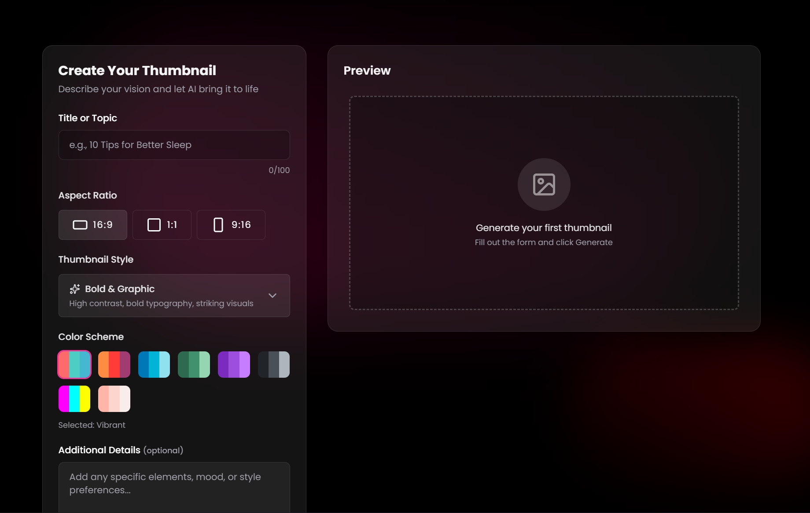

# Poet Sony — Developer Portfolio & Engineering Writings

<p align="center">
  
</p>

<p align="center">
  <strong>Oluwaniyi Amao (Poet Sony)</strong><br>
  Full-Stack Software Engineer & Applied Physics Student · 4x Hackathon Finalist
</p>

<p align="center">
  <a href="https://github.com/poet-sony101/react-portfolio-deployed">
    
  </a>
  <a href="https://github.com/poet-sony101/react-portfolio-deployed">
    
  </a>
  <a href="https://github.com/poet-sony101/react-portfolio-deployed">
    
  </a>
  <a href="https://github.com/poet-sony101/react-portfolio-deployed">
    
  </a>
  <a href="https://github.com/poet-sony101/react-portfolio-deployed">
    
  </a>
</p>

---

## 🌟 Overview

A premier personal web application and technical portfolio engineered for **Oluwaniyi Amao (Poet Sony)**. Built with React and structured around a bespoke **2026 Obsidian Glassmorphism** design system, this platform showcases full-stack client applications, rapid zero-to-one hackathon innovations, engineering essays, and interactive CLI tooling.

---

## ✨ Key Features & Architecture

### 1. 🏆 Dual-Mode Works Showcase
Seamlessly toggles between two specialized project galleries via an interactive segmented controller:
* **💼 Client & Commercial Works (6 Projects)**: Production client portals, brand identity systems, and SaaS platforms (StoqBox, GMG Salon & Spa, El Akubé Collection, Logo Knox, Boucherie, Story Board Films).
* **⚡ Hackathons & Competitions (7 Projects)**: Rapid hackathon prototypes, awards, and technical schematics with dedicated Problem/Solution breakdowns:
  * **Thumbn(AI)l** — *Top 6 Finalist @ Monad Blitz Lagos*
  * **UNICONNECT 1.0** — *Top 5 (4th Place) @ PESSA Innovation Challenge*
  * **UNICONNECT 2.0** — *11th Place @ SEES Hackathon 2026*
  * **BudTrack** — *Quarter-Finalist @ OPay Hackathon Challenge*
  * **KLOVA** — *Top 7 Finalist @ PIDEC 1.0 (Passive Drainage Bio-Filter System)*
  * **PayStack Hackathon & Xylem Challenge** — *Upcoming Sprint & Innovation Pipeline*

### 2. ✍️ Dedicated "Blog & Writings" Page (`#/blog`)
* Editorial writing experience inspired by modern engineering publications.
* Multi-category filtering across **Software & Systems**, **Applied Physics**, **Poetry & Spoken Word**, and **Public Speaking**.
* Distraction-free, responsive article reading modal with syntax highlighting and keyboard navigation (`ESC` to close).

### 3. 💻 Interactive Developer Terminal
* A custom in-browser command line terminal allowing technical visitors and recruiters to explore skills, run system diagnostics, view project stats, or trigger hidden commands (`help`, `skills`, `projects`, `clear`, `contact`).

### 4. 📱 Adaptive Responsive Navigation
* Zero-squash layout architecture with dynamic viewport adaptation from 4K ultrawides down to 320px mobile screens.
* Integrated mobile drawer menu with smooth glassmorphism backdrop blur.

---

## 🛠️ Tech Stack & Tooling

| Domain | Technologies & Libraries |
| :--- | :--- |
| **Frontend Core** | React 18, React DOM, Modern JSX |
| **Styling & Theme** | Native Modular CSS, CSS Custom Properties, Backdrop Filters, Obsidian Glassmorphism |
| **Icons & Visuals** | Custom Feather/Lucide-inspired SVG icon system, 2x Retina Live Captures, Octane 3D Renders |
| **Performance** | Webpack 5 production minification, Gzip compression, WebP/PNG asset optimization |
| **Deployment** | GitHub Pages / Vercel / Netlify compatible static build |

---

## 📁 Project Directory Structure

```text
portfolio/
├── public/
│   ├── favicon.ico
│   ├── index.html
│   └── manifest.json
├── src/
│   ├── assets/              # Optimized project screenshots & brand assets
│   ├── components/
│   │   ├── About/           # Bio, background, and applied physics credentials
│   │   ├── Blog/            # Somkene-inspired editorial writings & reader modal
│   │   ├── Contact/         # Direct email, social, and WhatsApp inquiry form
│   │   ├── Footer/          # Site-wide quick links and copyright
│   │   ├── Intro/           # Hero section with animated callouts
│   │   ├── Navbar/          # Responsive desktop & mobile drawer navigation
│   │   ├── Skills/          # Technical competencies & engineering toolkit
│   │   ├── Terminal/        # In-browser interactive developer CLI
│   │   ├── Works/           # Dual-mode Commercial & Hackathon showcase + Lightbox
│   │   └── common/          # Reusable icons and shared UI primitives
│   ├── App.js               # Primary application router & layout orchestrator
│   ├── App.css              # Global tokens, reset styles, and scrollbars
│   └── index.js             # React DOM entry point
└── package.json
```

---

## 🚀 Getting Started Locally

### Prerequisites
* **Node.js**: v18+ (tested with Node v22)
* **npm**: v9+

### Installation & Run

1. **Clone the repository**:
   ```bash
   git clone https://github.com/poet-sony101/react-portfolio-deployed.git
   cd react-portfolio-deployed
   ```

2. **Install dependencies**:
   ```bash
   npm install
   ```

3. **Start local development server**:
   ```bash
   npm start
   ```
   Open [http://localhost:3000](http://localhost:3000) to view the application in your browser.

4. **Build for production**:
   ```bash
   npm run build
   ```
   Compiles optimized production static files into the `build/` directory with 0 errors and 0 warnings.

---

## 📬 Contact & Inquiries

* **Developer**: Oluwaniyi Amao (Poet Sony)
* **Email**: [sonymaxwellie14@gmail.com](mailto:sonymaxwellie14@gmail.com)
* **WhatsApp**: [+234 915 976 7637](https://wa.me/+2349159767637)
* **GitHub**: [@poet-sony101](https://github.com/poet-sony101)

---

<p align="center">
  Crafted with precision by <strong>Poet Sony</strong> · 2026 Obsidian Glassmorphism System
</p>
